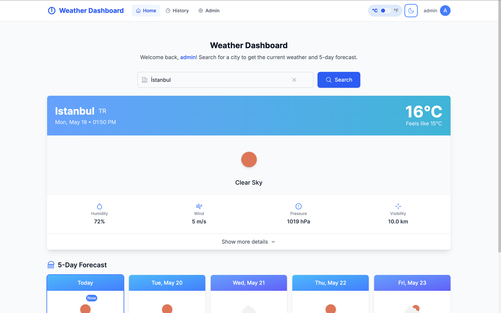

# Weather Dashboard

A comprehensive weather dashboard built with Next.js, React, TypeScript, and Tailwind CSS. This application allows users to search for real-time weather data for any city, view 5-day forecasts, and toggle between Celsius and Fahrenheit units.



## 🔗 Live Demo

**Live Application:** [https://app.app-nation-case.live](https://app.app-nation-case.live)

**Test Credentials:**
- Admin: admin@example.com / password123
- User: user@example.com / password123

## 🌤️ Features

- **City Search**: Search for weather information by city name
- **Current Weather**: Display current weather conditions with detailed information
- **5-Day Forecast**: View a 5-day weather forecast
- **Unit Toggle**: Switch between Celsius and Fahrenheit
- **Search History**: Track and revisit past searches (stored in localStorage)
- **Light/Dark Mode**: Fully featured theme support
- **Responsive Design**: Optimized UI for mobile, tablet, and desktop
- **Error Handling**: User-friendly error messages for invalid searches
- **Loading States**: Visual feedback during data fetching
- **Admin View**: Role-based access to view all user queries (admin only)

## 🛠️ Tech Stack

- **Next.js 15**: React framework with App Router architecture
- **TypeScript**: Type-safe code
- **Tailwind CSS 4**: Utility-first CSS framework for styling
- **Redux Toolkit**: State management
- **SWR**: Data fetching with caching, revalidation, and error handling
- **Axios**: HTTP client for API requests
- **Framer Motion**: Animations and transitions
- **React Icons**: Icon library
- **js-cookie**: Cookie management
- **OpenWeather API**: Weather data source via backend integration

## 🚀 Getting Started

### Live Demo

The application is live at: [https://app.app-nation-case.live](https://app.app-nation-case.live)

You can use the following credentials to test the application:

**Admin User:**
- Email: admin@example.com
- Password: password123

**Regular User:**
- Email: user@example.com
- Password: password123

### Local Development

#### Prerequisites

- Node.js 20.x or higher
- npm or yarn

#### Installation

1. Clone the repository:
   ```bash
   git clone https://github.com/your-username/weather-dashboard.git
   cd weather-dashboard
   ```

2. Install dependencies:
   ```bash
   npm install
   # or
   yarn
   ```

3. Create a `.env.local` file in the project root with your API base URL:
   ```
   NEXT_PUBLIC_API_BASE_URL=https://api.app-nation-case.live/api
   ```

   You can change this to your local backend API if you're running it locally.

4. Run the development server:
   ```bash
   npm run dev
   # or
   yarn dev
   ```

5. Open [http://localhost:3000](http://localhost:3000) in your browser to see the application.

## 📝 Project Structure

```
weather-dashboard/
├── src/
│   ├── app/                # Next.js App Router
│   │   ├── (auth)/         # Authentication-related pages
│   │   ├── dashboard/      # Dashboard pages
│   │   ├── globals.css     # Global styles
│   │   ├── layout.tsx      # Root layout
│   │   └── page.tsx        # Home page
│   ├── components/         # Reusable components
│   │   ├── auth/           # Authentication components
│   │   ├── dashboard/      # Dashboard components
│   │   ├── layout/         # Layout components
│   │   ├── ui/             # UI components
│   │   └── weather/        # Weather-related components
│   ├── contexts/           # React contexts
│   ├── hooks/              # Custom hooks
│   ├── lib/                # Utility functions
│   ├── services/           # API service
│   ├── store/              # Redux store
│   └── types/              # TypeScript type definitions
├── public/                 # Static assets
└── ...configuration files
```

## 📋 Implemented Requirements

### Core Requirements
- ✅ Search bar for city input
- ✅ Display of required weather data
- ✅ Error handling for invalid searches
- ✅ Search history with persistence

### User Experience & Design
- ✅ Fully responsive design
- ✅ Light and dark theme support
- ✅ Intuitive layout and visual presentation
- ✅ Animated transitions and interactions

### Technical Implementation
- ✅ Next.js App Router
- ✅ Performance optimization
- ✅ Clean code structure and organization
- ✅ Authentication and role-based access control

### Extended Features
- ✅ 5-day weather forecast
- ✅ Toggle between metric and imperial units
- ✅ TypeScript implementation
- ✅ Redux Toolkit for state management
- ✅ SWR for data fetching and caching
- ✅ Role-based access control (admin dashboard)
- ✅ Authentication with JWT and refresh tokens

## 🔍 Assumptions and Decisions

- **Backend Integration**: The application integrates with a custom backend API that acts as a proxy to the OpenWeather API. This approach provides better security and allows for user authentication and history tracking.
- **Search History**: The search history is stored both locally and on the server. Local history ensures quick access, while server-side history enables cross-device access and admin monitoring.
- **Forecast Display**: For the 5-day forecast, a single data point (midday) is used to represent each day.
- **Authentication Flow**: The app uses JWT tokens with refresh token rotation for security. Tokens are stored in cookies with secure attributes.
- **Default Units**: Temperature is displayed in Celsius by default, with the option to switch to Fahrenheit. User preference is stored locally.
- **Theme Preference**: The app respects the user's system theme by default but allows manual toggling. Theme preference is saved to localStorage.

## 📱 Responsive Design

The dashboard is optimized for various screen sizes:
- **Mobile**: Single column layout with stacked components and simplified navigation
- **Tablet**: Two-column layout for forecast cards with expanded information
- **Desktop**: Full multi-column layout with side panels and detailed information

## 🔐 Authentication

The app includes a complete authentication system:
- User registration and login
- JWT-based authentication with refresh tokens
- Role-based access control (admin/user)
- Protected routes with middleware
- Secure token storage in cookies

## 🚀 Deployment

The application is already deployed on Vercel at [https://app.app-nation-case.live](https://app.app-nation-case.live).

If you want to deploy your own version, you can do so with a single click:

[](https://vercel.com/new/clone?repository-url=https%3A%2F%2Fgithub.com%2Fyour-username%2Fweather-dashboard)

Remember to set up the following environment variables in your Vercel project settings:
- `NEXT_PUBLIC_API_BASE_URL`: URL of your backend API

## 📈 Future Improvements

- Add geolocation support to get weather for the user's current location
- Implement weather maps with interactive visualization
- Add air quality index and other environmental data
- Support for saving favorite locations
- Add multilingual support
- Implement PWA features for offline access
- Add more detailed weather statistics and charts

## 📄 License

This project is created as part of a coding assessment and is not licensed for commercial use.